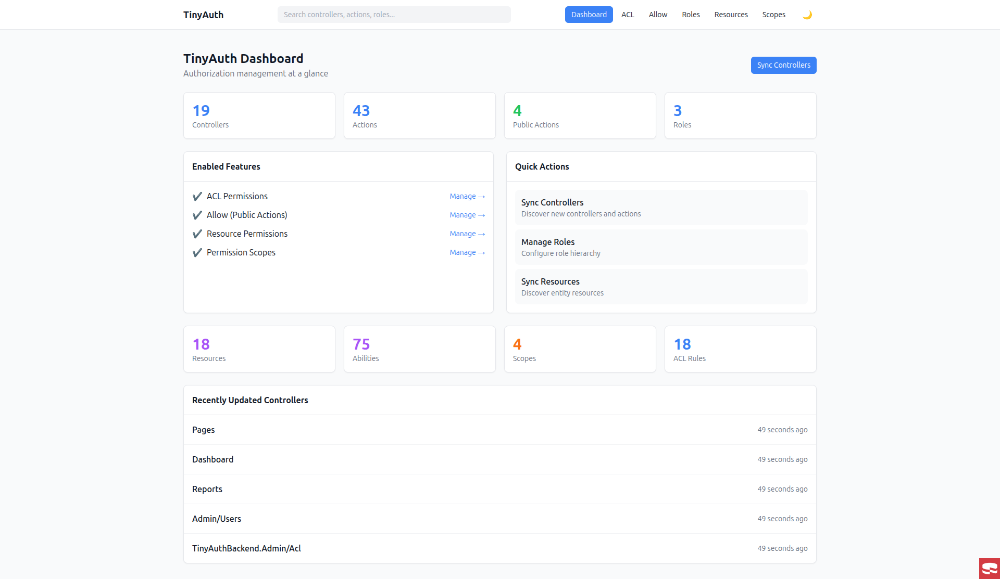
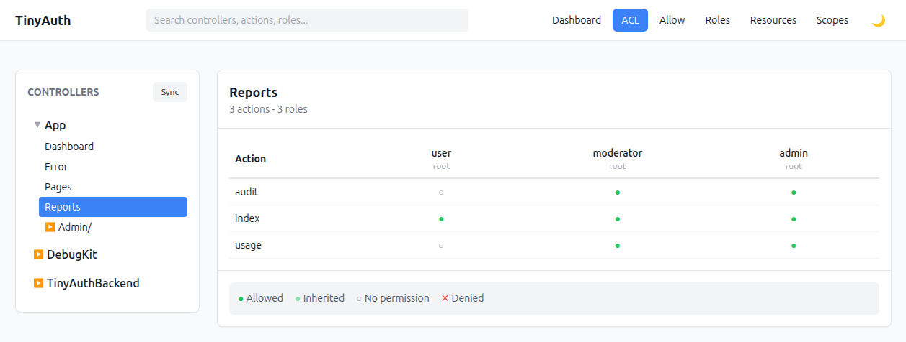
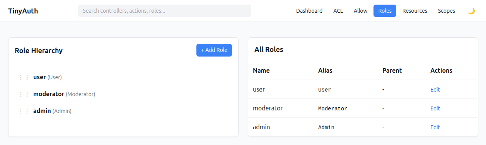
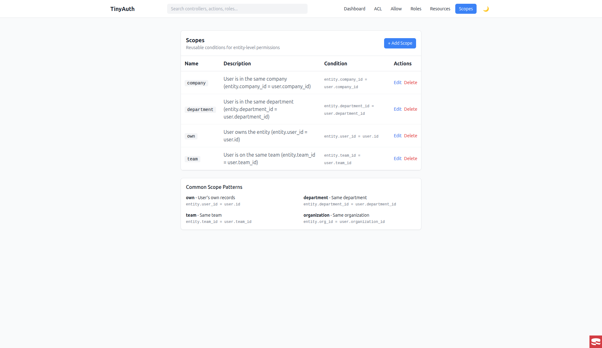

# CakePHP TinyAuth Demo

A demo application showcasing [TinyAuth](https://github.com/dereuromark/cakephp-tinyauth) and [TinyAuth Backend](https://github.com/dereuromark/cakephp-tinyauth-backend) plugins for CakePHP 5.x.

## Features

- **Role-based access control (RBAC)** with database-backed permissions
- **TinyAuth Backend** admin interface at `/admin/auth/`
- **Role simulation** for testing different permission levels
- **Demo controllers** showing protected and public actions
- **Resource-level permissions** with scoped access (entity-level authorization)

## Requirements

- PHP 8.2+
- MySQL/MariaDB
- [DDEV](https://ddev.com/) (recommended) or any local development environment

## Quick Start with DDEV

```bash
# Clone the repository
git clone https://github.com/dereuromark/cakephp-tinyauth-demo.git
cd cakephp-tinyauth-demo

# Start DDEV
ddev start

# Install dependencies
ddev composer install

# Set up configuration if the files do not exist yet
test -f config/.env || cp config/.env.example config/.env
test -f config/app_local.php || cp config/app_local.example.php config/app_local.php

# Review config/.env and make sure APP_FULL_BASE_URL and SECURITY_SALT are correct.
# DDEV will usually create config/.env and composer install will usually create
# config/app_local.php for you on first setup.

# Run migrations
ddev exec bin/cake migrations migrate
ddev exec bin/cake migrations migrate -p TinyAuthBackend

# Sync controllers, actions, and resource entities into the TinyAuth
# backend tables. Equivalent to clicking Sync in /admin/auth/sync.
ddev exec bin/cake tiny_auth_backend sync

# Seed demo data (roles, scopes, users, resources, articles, projects)
ddev exec bin/cake seed_demo_data

# Visit the app
ddev launch
```

## Demo Roles

The demo includes three roles with hierarchical permissions:

| Role | ID | Description |
|------|-------|-------------|
| admin | 3 | Full access to everything |
| moderator | 2 | Access to reports and moderation features |
| user | 1 | Basic user access |

## Demo Users

The seeder creates sample users for testing resource permissions:

| User | Role | Team | Purpose |
|------|------|------|---------|
| alice | User | Engineering | Test "own" scope - owns some articles/projects |
| bob | User | Engineering | Same team as Alice - test "team" scope |
| charlie | User | Marketing | Different team - test cross-team restrictions |
| diana | Moderator | Sales | Higher role with broader permissions |
| admin | Admin | None | Full access to everything |

## URLs

- **Home**: `/` - Shows current role and available actions
- **TinyAuth Admin**: `/admin/auth/` - Permission management interface
- **Role Switcher**: Use the dropdown on the home page to simulate different roles
- **Articles Demo**: `/articles` - Resource permissions with "own" scope
- **Projects Demo**: `/projects` - Resource permissions with "team" scope

## Resource-Level Permissions Demo

TinyAuth Backend supports entity-level permissions beyond controller/action ACL. This demo showcases two examples:

### Articles (Own Scope)

Demonstrates permissions where users can only edit/delete their own content:

| Role | View | Edit | Delete |
|------|------|------|--------|
| User | All | Own only | Own only |
| Moderator | All | All | Own only |
| Admin | All | All | All |

**How it works:** The "own" scope compares `article.user_id` with `user.id`.

### Projects (Team Scope)

Demonstrates team-based access where users can access content from their team:

| Role | View | Edit | Delete |
|------|------|------|--------|
| User | Team only | Own only | None |
| Moderator | All | Team only | Own only |
| Admin | All | All | All |

**How it works:** The "team" scope compares `project.team_id` with `user.team_id`.

## Demo Scopes

Scopes define conditions for entity-level access control. The seeder creates these scopes:

| Scope | Entity Field | User Field | Use Case |
|-------|-------------|------------|----------|
| `own` | `user_id` | `id` | User can only access their own records |
| `team` | `team_id` | `team_id` | User can access records from their team |
| `department` | `department_id` | `department_id` | Department-based access |
| `company` | `company_id` | `company_id` | Company-wide access |

### How Scopes Work

When a role has a resource permission with a scope attached, the condition is evaluated:

```
entity.{entity_field} === user.{user_field}
```

Example: A "user" role with "edit" ability on "Articles" with "own" scope means:
- User can edit articles where `article.user_id === user.id`

Without a scope, the permission grants access to all entities.

## Testing Resource Permissions

1. Visit the home page and select a role (e.g., "User")
2. Select a user identity (e.g., "alice" - User ID 1, Team ID 1)
3. Navigate to `/articles`:
   - You'll see all articles (view: no scope restriction)
   - Only articles you own will show edit/delete options
4. Navigate to `/projects`:
   - You'll only see projects from your team
   - Only your own projects can be edited

Try switching between users to see how permissions change:
- **alice** (Engineering): Can see Engineering projects, edit own
- **bob** (Engineering): Same team as Alice, can see same projects
- **charlie** (Marketing): Different team, sees only Marketing projects
- **diana** (Moderator): Can see all projects, edit within her team

## Configuration

### Roles Configuration

Roles are defined in `config/roles.php`:

```php
return [
    'user' => 1,
    'moderator' => 2,
    'admin' => 3,
];
```

### TinyAuth Backend

The admin interface provides:

- **Dashboard**: Overview of controllers, actions, and roles
- **ACL**: Manage role-based permissions per action
- **Allow**: Configure public (unauthenticated) actions
- **Roles**: Manage role definitions
- **Resources**: Entity-level permissions (with scope support)
- **Scopes**: Define reusable conditions for entity access

## Screenshots

### Dashboard
Overview of your authorization setup at a glance.



### ACL Permissions
Manage which roles can access each controller action.



### Public Actions (Allow)
Configure which actions are publicly accessible without authentication.


### Roles
Define and organize your role hierarchy.



### Resources
Entity-level permissions with scoped access (e.g., users can only edit their own articles).


### Scopes
Reusable conditions for fine-grained entity access control.



## Implementation Guide

### Wiring `cakephp/authorization`

For the `FullBackend`, `NativeAuth`, and `ExternalRoles` strategies, the demo wires the Authorization plugin with `TinyAuthBackend\Policy\TinyAuthResolver`.
One allowlist, one policy, both entity checks and query scoping go through the same DB rules:

```php
// src/Application.php
use Authorization\AuthorizationService;
use TinyAuthBackend\Policy\TinyAuthResolver;

public function getAuthorizationService(ServerRequestInterface $request): AuthorizationServiceInterface
{
    $resolver = new TinyAuthResolver([
        \App\Model\Entity\Article::class,
        \App\Model\Entity\Project::class,
        \App\Model\Table\ArticlesTable::class,
        \App\Model\Table\ProjectsTable::class,
    ]);

    return new AuthorizationService($resolver);
}
```

Controllers then use the idiomatic calls:

```php
$article = $this->Articles->get($id);
$this->Authorization->authorize($article, 'edit');

$query = $this->Authorization->applyScope($this->Articles->find());
```

Both dispatch through `TinyAuthPolicy` → `TinyAuthService` → DB rules → role hierarchy → scopes.

For apps that don't load `cakephp/authentication`, the plugin also ships `TinyAuthBackend\Identity\EntityIdentity`, a minimal wrapper that turns any Cake entity into a valid `Authorization\IdentityInterface` — drop it on the request under the configured identity attribute from your own middleware and you're done.

### Using TinyAuthService in Controllers

```php
use TinyAuthBackend\Service\TinyAuthService;

// Check if user can access specific entity
$service = new TinyAuthService();
$canEdit = $service->canAccess(
    $userRoleAlias,    // e.g., 'User'
    'Article',         // Resource name
    'edit',            // Ability
    $article,          // Entity being accessed
    $user              // Current user
);

// Get scope conditions for query filtering
$conditions = $service->getScopeCondition(
    $userRoleAlias,
    'Article',
    'view',
    $user
);
// Returns: null (no access), [] (full access), or ['user_id' => 1] (scoped)
```

### Permission Checking Flow

1. **Controller/Action level**: TinyAuth ACL checks if role can access the action
2. **Entity level**: Your controller uses TinyAuthService to check resource permissions
3. **Query filtering**: Use scope conditions to filter database queries

## License

MIT License
